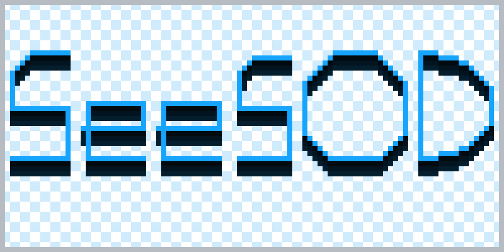
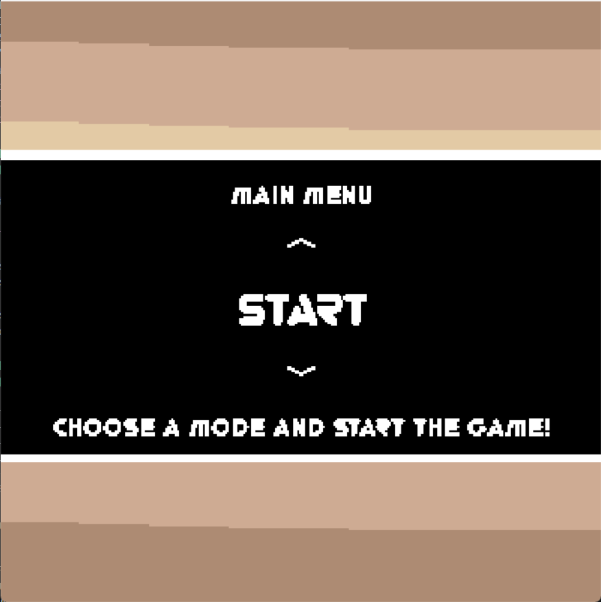
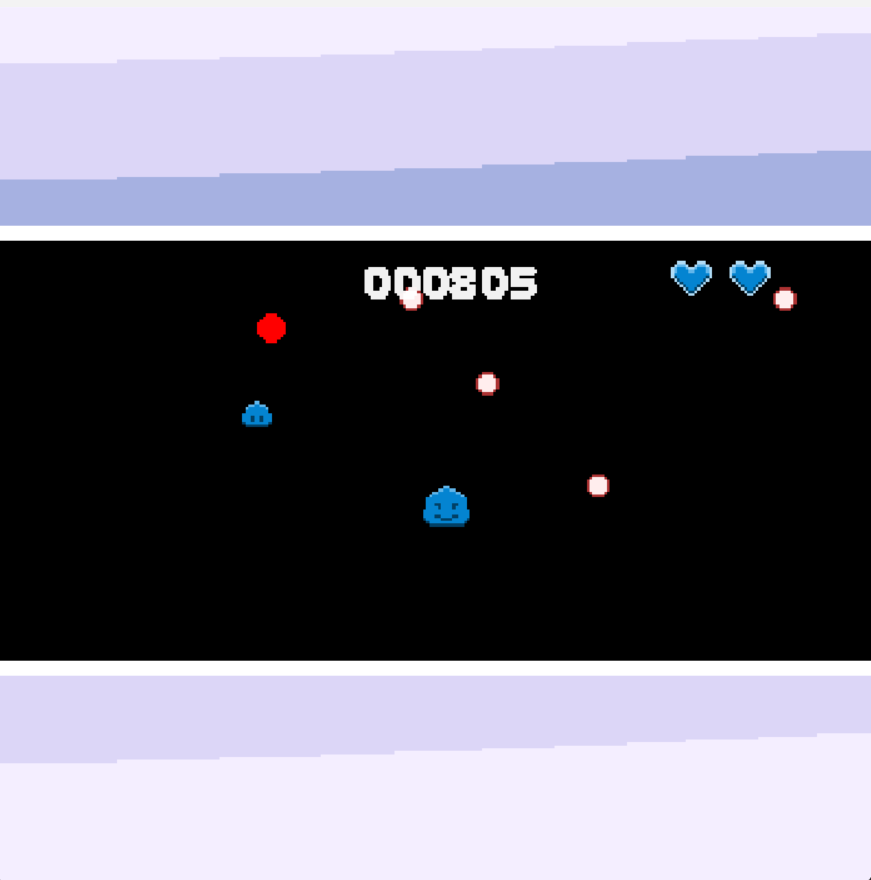
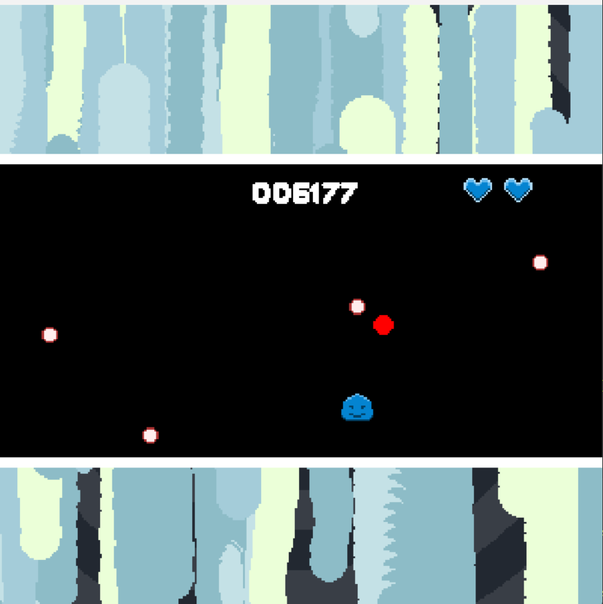
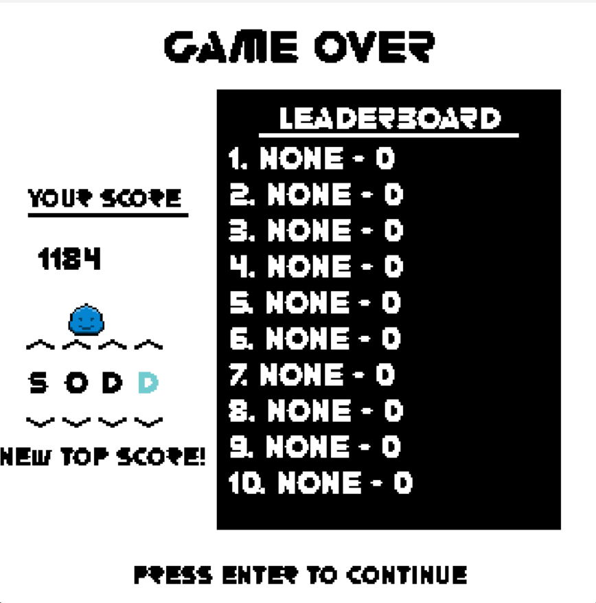

<h1 align="center"> seeSOD - ICS-4U1 Culminating Project </h1>

  

<h2> About </h2>

This game is a bullet-hell / score attack game.

It features three distinct modes along with a tutorial.

<h2> Screenshots </h2>

<h3> Menu </h3>  

<h3> Gameplay </h3>  

<h3> Leaderboard </h3>  

<h3> This game was made for ICS 4U1 (Computer Science Grade 12) for my culminating project </h3>
<h3> seeSOD was developed using PyGame (it must be installed to run) <h3>
